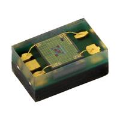
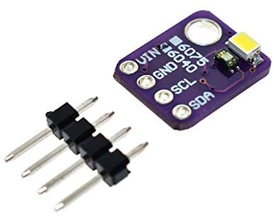

# VEML6040
Vishay VEML6040 RGBW color sensor library for Arduino

Click [here](https://www.vishay.com/ppg?84276) to learn more about the Vishay VEML6040 RGBW color sensor.

# Installation

To install, download the latest release as .zip file and add it to your
[Arduino IDE](http://www.arduino.cc/en/main/software) via

	Sketch => Include Library => Add .ZIP Library...

# Quick Start

1. Connect the VEML6040 sensor to your Arduino board's standard I2C bus. Check
   the pinout of your Arduino board to find the correct pins. 

   **Important:** without additional level shifting the VEML6040 is not compatible with 5v Arduino boards

   

   This breakout board has additional level shifting built in and can therefore be used with 5V Arduino boards.

   * **VIN** of the VEML6040 to the **3.3V** of your Arduino board (5V is also possible)
   * **GND** of the VEML6040 to the **GND** of your Arduino board
   * **SCL** of the VEML6040 to the **SCL** of your Arduino board
   * **SDA** of the VEML6040 to the **SDA** of your Arduino board 

2. Open the `auto_mode` sample project within the Arduino IDE

		File => Examples => VEML6040 => auto_mode

3. Click the `Upload` button in the Arduino IDE or

		Sketch => Upload

4. When the upload process has finished, open the `Serial Monitor` or `Serial
   Plotter` via the `Tools` menu to observe the measured values. Note that the `Baud Rate` in the corresponding window has
   to be set to `9600 baud`.
